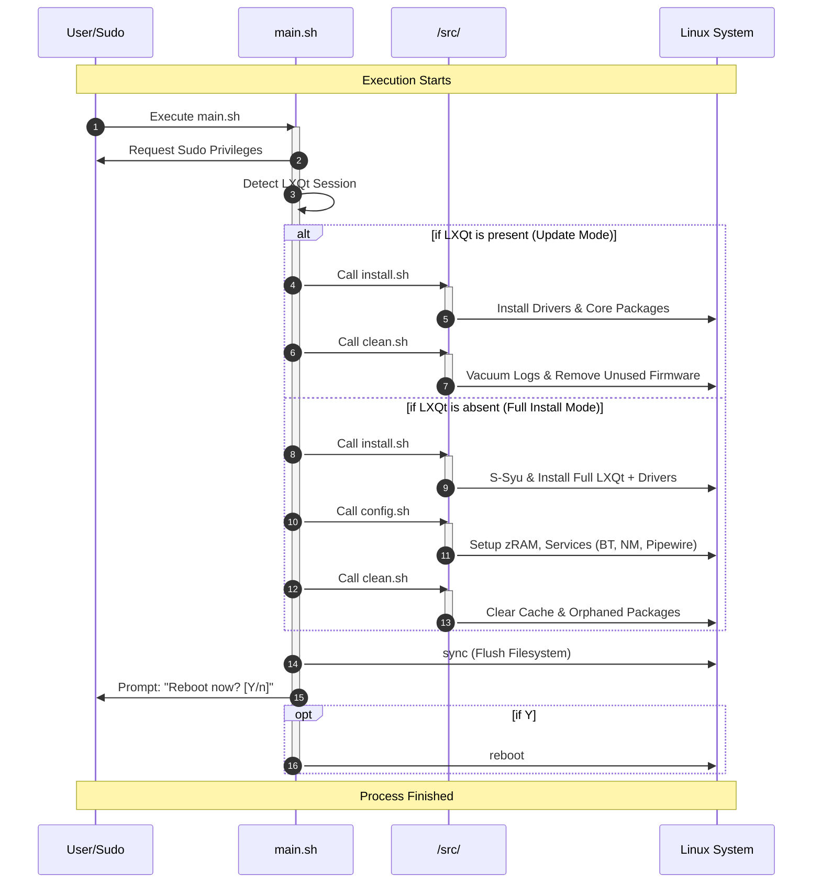

# 🪽 Aqtive
LXQt on Arch made effortless.
## 📜 System Requirements
| Component | Minimum | Recommended |
| :--- | :--- | :--- |
| **Processor** | 64-bit x86-64 | Dual Core or better |
| **RAM** | 1GB | ≥2GB |
| **Storage** | 4GB | ≥8GB |
| **Architecture** | Arch Linux | Post-Archinstall |

---

## 🚀 Installation
Run this command post-archinstall as a user with `sudo` privileges. 

```bash
curl -fsSL https://is.gd/aqtive | sh
```

---

## ❓ How it works



---

## 📜 License

&copy; Aqtive 2026. Code released under the [GNU General Public License v3.0](https://github.com/kaiserrrrrr/aqtive/blob/master/LICENSE).
